# fancy-computer-store-aspnet-webforms
An e-commerce website built using ASP.Net framework with MySQL back-end. All product images, descriptions, prices, and reviews are stored in the database.

Cookies are used to manage a customer's shopping cart.

## Main Page

The main landing page of the webside displays the product categories that customers can choose from as well as a slider that displays current promotions.

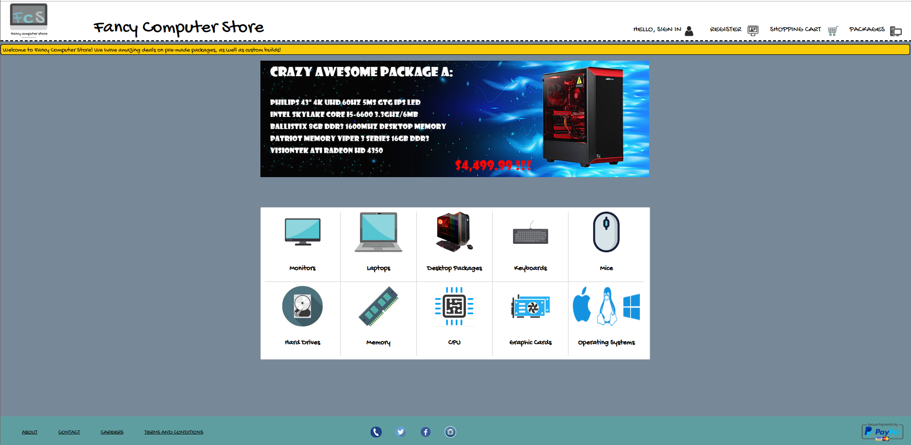

## Login

Users can order products with or without an account, however, if they wish to retrieve previous orders they must do so by logging into their account.

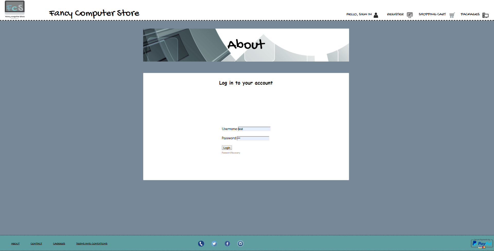

## Register

Customers can register for an account so that they may be able to store and retrieve previous purchase invoices as well as write product reviews.

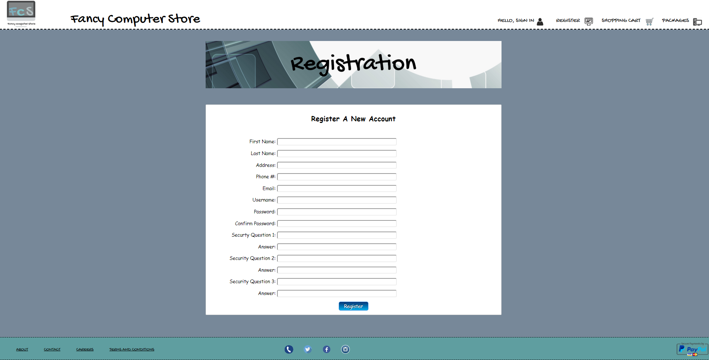

## Product Category

The product category page displays all products that belong to a selected category.

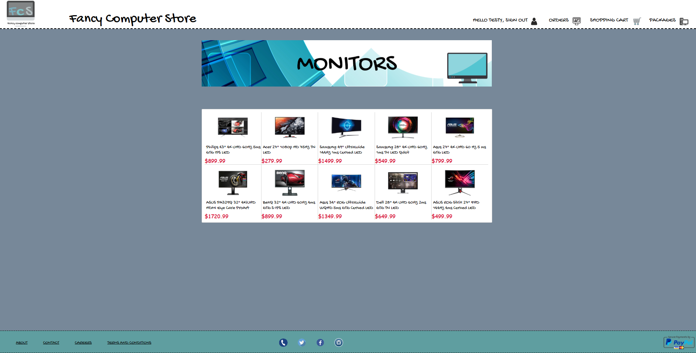

## Product Detail

The product detail page retrieves each product's corresponding price, description, and reviews from the server.

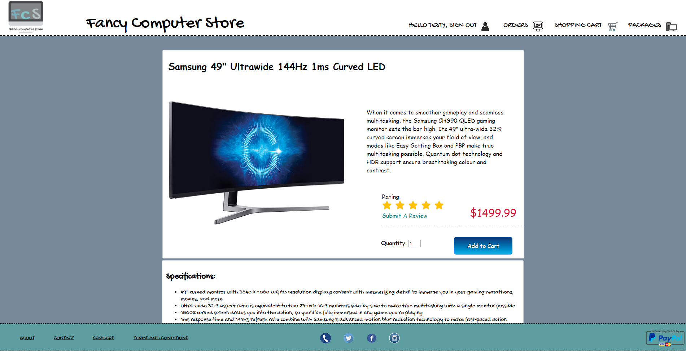

## Product Review

All product reviews are loaded on the product detail page. Customized packages do not have reviews.

## Write a Product Review

When signed into an account a user may review a product.

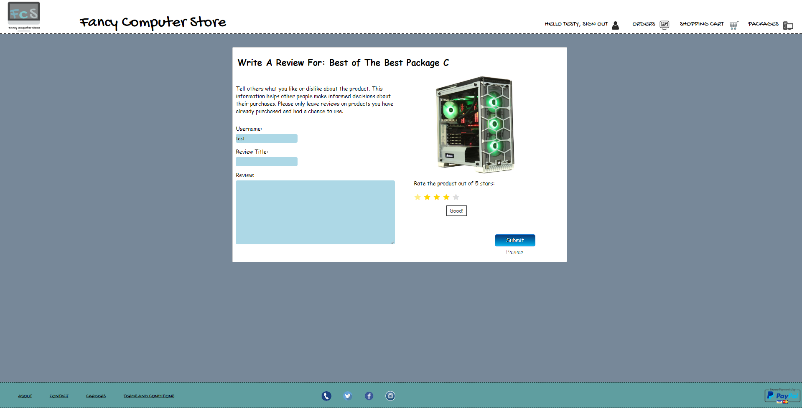 

## Packages

Customers can choose to purchase a pre-determined package, or customize it (more on customization below).

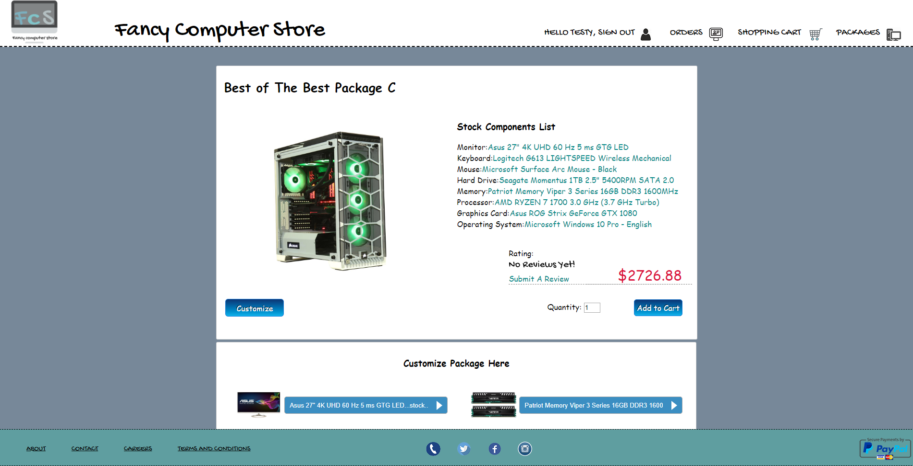

## Customize Package

Customers can either purchase a pre-determined package, or customize it to their liking. Package component images/prices update as user's make their selections.

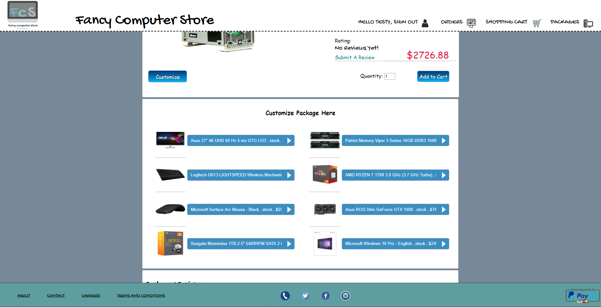

## Shopping Cart

Customers can update the product quantity here if they wish, as well as process their order. If a user enters '0' as a quantity the product will be removed from their shopping cart.

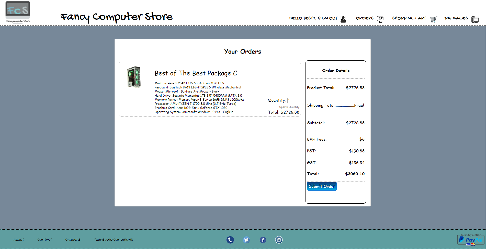

## Invoice

After placing an order the customer will be shown an invoice.

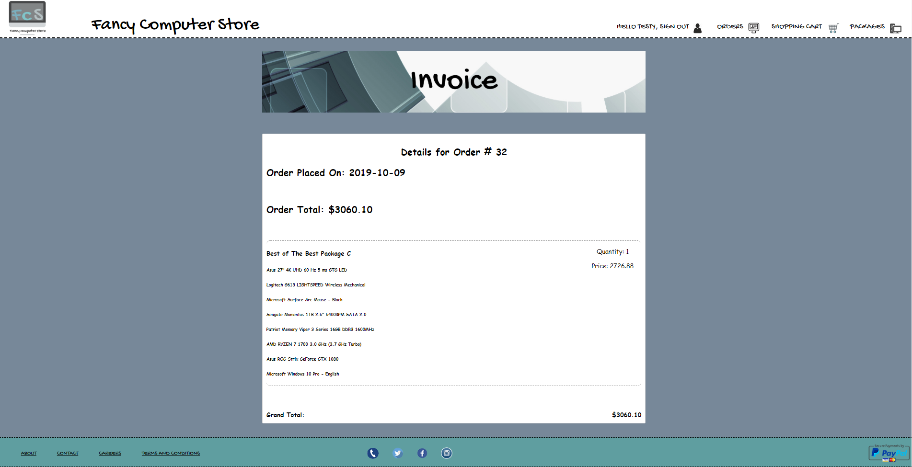

## Previous Orders

Customers who are signed into their accounts can go to this page to retrieve a list of all invoices attached to their account.

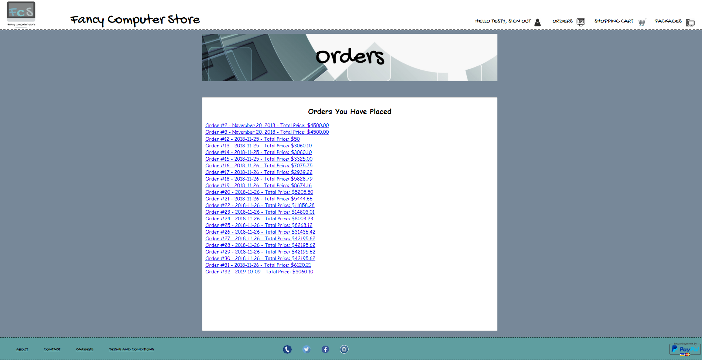

## Contact Us

Users can use this form to send questions/feedback to the company. If a user is signed in, their name and email address will be auto-filled when this page is displayed.

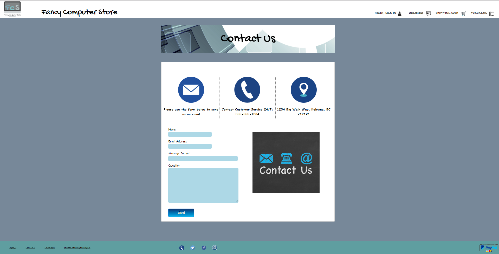

# To Do

This project is a work in progress, and is meant as a testing ground for me to practice full-stack development. With that being said, the following is a list of things I would like to change or incorporate in the future:

- UI fixes (clean up forms, product category images, etc.)
- Create account management page that allows customers to edit account details (password, address, payment methods, etc.)
- Add administrator portal that gives authorized users access to database reports (daily/weekly/monthly income, list of accounts, most popular products, etc.)
